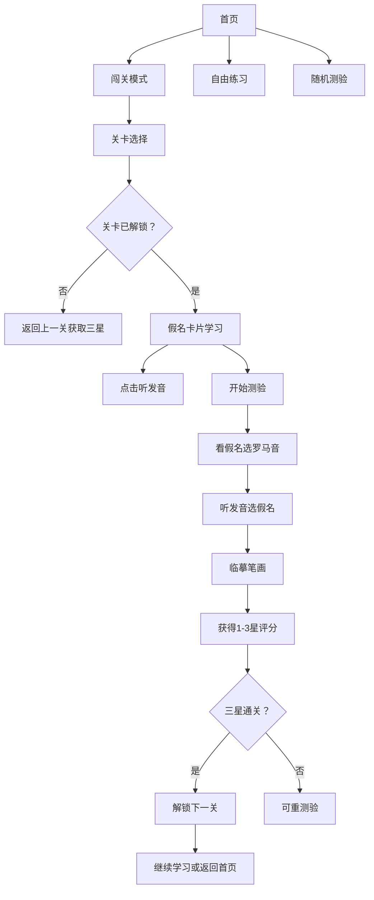

## 1. 产品概述

日语五十音图闯关学习游戏，帮助日语初学者通过游戏化方式高效记忆平假名和片假名。通过看、听、写多感官训练结合闯关解锁机制，让学习过程更有趣味性和成就感。

- 目标用户：日语零基础初学者，想要系统化学习五十音图的自学者
- 产品价值：将枯燥的假名记忆转化为趣味闯关游戏，结合多种练习模式强化记忆

## 2. 核心功能

### 2.1 用户角色

| 角色 | 注册方式 | 核心权限 |
|------|----------|----------|
| 学习者 | 无需注册，本地存储进度 | 使用所有学习、练习、测验功能 |

### 2.2 功能模块

1. **首页**：模式选择（闯关模式/自由练习/随机测验）、学习进度展示
2. **关卡选择**：按行（あ行、か行等）展示平假名和片假名关卡，显示星级和解锁状态
3. **关卡学习**：展示该行假名卡片，点击可听发音
4. **测验模式**：看假名选罗马音、听发音选假名、临摹笔画
5. **临摹画布**：Canvas 描红练习，对比手写轨迹
6. **自由练习**：可选择任意行的假名进行无压力练习
7. **随机测验**：从已解锁假名中随机出题综合测试

### 2.3 页面详情

| 页面名称 | 模块名称 | 功能描述 |
|----------|----------|----------|
| 首页 | 模式选择区 | 三大模式入口卡片，带图标和动画效果 |
| 首页 | 进度展示区 | 显示已学习假名数、总星数、连续学习天数 |
| 关卡选择页 | 平假名关卡区 | 10行平假名关卡，每行展示星级和解锁状态 |
| 关卡选择页 | 片假名关卡区 | 10行片假名关卡，每行展示星级和解锁状态 |
| 关卡学习页 | 假名卡片网格 | 5个假名卡片，点击卡片播放发音，显示平假名/片假名/罗马音 |
| 关卡学习页 | 开始测验按钮 | 学习完成后进入测验环节 |
| 测验页 | 题目展示区 | 动态切换三种题型，显示题号和进度条 |
| 测验页 | 选项交互区 | 4选1选项按钮或临摹画布 |
| 测验页 | 结果反馈区 | 答对答错即时反馈，完成后显示三星评分 |
| 自由练习页 | 选择面板 | 可多选任意行进行练习 |
| 自由练习页 | 练习卡片 | 可翻转的假名卡片，支持发音 |
| 随机测验页 | 随机题目 | 从已解锁假名中随机抽取题目 |

## 3. 核心流程

用户进入首页选择闯关模式 → 选择要学习的行关卡 → 浏览该行假名卡片并听发音 → 开始测验 → 依次完成三种题型（看假名选读音、听读音选假名、临摹笔画）→ 获得1-3星评分 → 三星通关解锁下一关 → 继续学习或切换到自由练习/随机测验。

## 4. 用户界面设计

### 4.1 设计风格

- **设计基调**：日式和风 + 现代游戏化设计，温暖樱花色调
- **主色调**：樱花粉 #FFB7C5 作为主色，搭配靛蓝 #2B4C7E 作为对比色
- **辅助色**：米色背景 #FFF8F0，金色星星 #FFD700
- **按钮风格**：圆润大按钮，带微浮雕效果和悬停上浮动画
- **字体**：使用 Noto Sans SC / Noto Sans JP 作为主体字体，假名展示区使用衬线风格字体增强仪式感
- **布局风格**：卡片式布局，圆角大、阴影柔和
- **图标风格**：使用 Lucide 线性图标，搭配和风化装饰元素

### 4.2 页面设计概述

| 页面名称 | 模块名称 | UI 元素 |
|----------|----------|---------|
| 首页 | Hero 区域 | 大标题"五十音闯关"，樱花飘落动画背景，副标题 |
| 首页 | 模式卡片 | 三张并排卡片，各带图标、标题、描述，悬停放大 |
| 首页 | 进度条 | 横向进度条显示整体学习进度 |
| 关卡选择页 | 关卡网格 | 2列×10行关卡按钮，已解锁显示彩色，未解锁灰色加锁图标，三星显示金色星星 |
| 关卡学习页 | 假名卡片 | 大卡片展示假名，下方罗马音，点击发音波纹动画 |
| 测验页 | 题目容器 | 居中大卡片显示题目/假名，进度条在顶部，选项四宫格 |
| 测验页 | 临摹画布 | 圆角 Canvas 画布，浅色描红底图，画笔可调节粗细 |
| 结果弹窗 | 星级展示 | 三颗大星星动画依次点亮，分数展示，重测/下一关按钮 |

### 4.3 响应式

- Desktop-first 设计，针对桌面端优化布局
- 移动端自适应：卡片堆叠、按钮放大、触摸优化
- 临摹画布支持触屏手写和鼠标绘制
- 所有交互元素最小触控区域 44px

### 4.4 动画与微交互

- 页面加载：元素依次淡入上浮（staggered reveal）
- 假名卡片：点击产生波纹扩散效果，轻微缩放反馈
- 正确答案：绿色光晕 + 弹跳动画
- 错误答案：红色抖动提示
- 星星点亮：依次缩放弹跳出现
- 樱花飘落：首页背景持续粒子动画
