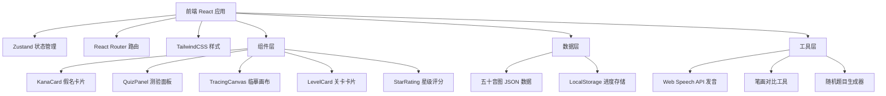
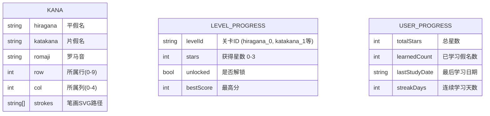

## 1. 架构设计



## 2. 技术描述

- **前端**：React@18 + TypeScript + TailwindCSS@3 + Vite
- **初始化工具**：vite-init (react-ts 模板)
- **后端**：无，纯前端应用
- **数据存储**：LocalStorage（持久化学习进度），JSON 静态文件（假名数据）
- **状态管理**：Zustand（轻量级状态管理）
- **路由**：react-router-dom@6
- **图标**：lucide-react
- **发音**：Web Speech API (SpeechSynthesis)
- **画布**：原生 HTML5 Canvas API

## 3. 路由定义

| 路由 | 用途 |
|------|------|
| `/` | 首页，模式选择与进度展示 |
| `/levels` | 关卡选择页，平假名/片假名关卡列表 |
| `/learn/:type/:row` | 关卡学习页，浏览该行假名卡片 |
| `/quiz/:type/:row` | 测验页，完成三种题型获得星级 |
| `/practice` | 自由练习页，选择假名范围练习 |
| `/random-quiz` | 随机测验页，综合测试已解锁假名 |

## 4. 数据模型

### 4.1 数据模型定义



### 4.2 假名数据结构 (kana.json)

```json
{
  "rows": [
    {
      "id": "a",
      "name": "あ行",
      "kana": [
        {
          "hiragana": "あ",
          "katakana": "ア",
          "romaji": "a",
          "strokes": ["M 20 30 Q 30 20 40 30", "..."]
        }
      ]
    }
  ]
}
```

## 5. 核心组件职责

| 组件名 | 文件路径 | 职责 |
|--------|----------|------|
| KanaCard | `src/components/KanaCard.tsx` | 展示单个假名，支持点击发音、翻转显示 |
| LevelCard | `src/components/LevelCard.tsx` | 关卡选择卡片，显示星级和解锁状态 |
| QuizPanel | `src/components/QuizPanel.tsx` | 测验题目容器，管理题目流转和答题逻辑 |
| TracingCanvas | `src/components/TracingCanvas.tsx` | 临摹画布，手写记录和笔画对比 |
| StarRating | `src/components/StarRating.tsx` | 星级展示组件，支持动画点亮 |
| ProgressBar | `src/components/ProgressBar.tsx` | 进度条组件 |

## 6. 状态管理 (Zustand Store)

```typescript
interface AppState {
  progress: UserProgress;
  levelProgress: Record<string, LevelProgress>;
  unlockLevel: (levelId: string) => void;
  updateStars: (levelId: string, stars: number) => void;
  updateStreak: () => void;
}
```

## 7. 关键技术实现点

1. **Web Speech API**：使用 `window.speechSynthesis` 配合日语语言包 (`ja-JP`) 发音
2. **Canvas 临摹**：监听 `mousedown/mousemove/mouseup` 和 `touchstart/touchmove/touchend` 事件记录轨迹，使用离屏 Canvas 做像素级相似度对比
3. **三星评分算法**：根据正确率、笔画相似度、答题时间综合计算
4. **进度持久化**：所有学习进度通过 `localStorage` 自动保存和恢复
